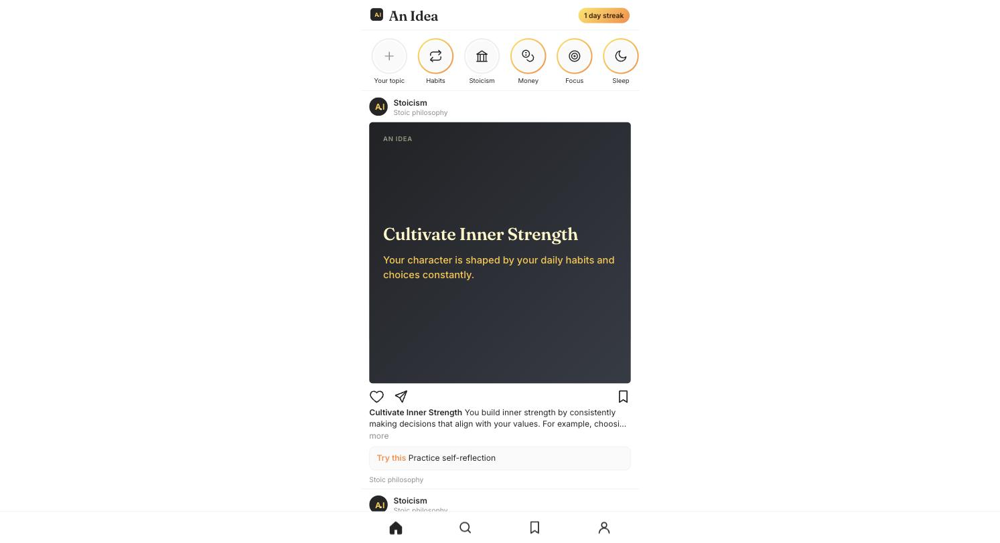

# An Idea ☝️💡

[](https://github.com/RouterGlock/an-idea)
[](https://an-idea.pages.dev)
[](LICENSE)

Big ideas in small bites. An Instagram-style feed of AI-written idea cards:
pick a topic, scroll, double-tap to like, bookmark to save, keep a daily
streak. No account, no backend to run — it's a single static page plus one
serverless function, deployed on Cloudflare's free tier.



## How it works

- **`public/index.html`** — the entire frontend, no build step, no framework.
- **`functions/api/ideas.js`** — a Cloudflare Pages Function that calls
  Workers AI (Llama 3.3 70B, with Qwen3 and Llama 4 Scout as fallbacks) and
  returns 5 idea cards for a topic.
- **`public/manifest.json`, `sw.js`, `icons/`** — installs as a real PWA;
  add it to your iPhone's home screen and it runs full-screen.

No API key anywhere: idea generation runs on Cloudflare Workers AI, which
includes 10,000 free neurons a day (resets at 00:00 UTC).

## Deploy your own (~2 minutes)

```bash
git clone https://github.com/RouterGlock/an-idea.git
cd an-idea
./deploy.sh
```

The script logs you into Cloudflare, creates the `an-idea` Pages project,
and deploys. Then on your phone: open the `*.pages.dev` URL in Safari →
Share → **Add to Home Screen**.

### Auto-deploy on push

`.github/workflows/deploy.yml` redeploys on every push to `main` (and on
manual "Run workflow"). It needs one repo secret — a Cloudflare API token
with the **Account · Cloudflare Pages · Edit** permission:

```bash
gh secret set CLOUDFLARE_API_TOKEN --repo RouterGlock/an-idea
```

The account ID is inlined in the workflow (it isn't secret). Once this is
set, deploy with `git push` instead of `./deploy.sh` to avoid mixed
deployment sources.

### Local dev

```bash
npx wrangler pages dev public --remote   # --remote needed: AI models don't run locally
```

## Costs

Free. Each topic load is one Workers AI call (~1.5k tokens) — roughly 30–60
loads a day inside the free 10k-neuron pool on Llama 3.3 70B; swap the first
entry in `MODELS` for a smaller model if you want more headroom. If the daily
pool runs out, calls fail until 00:00 UTC and the app shows a retry button.
Cloudflare retires models occasionally — run `npx wrangler ai models list`
to see what's current.

## License

MIT © 2026 RouterGlock — see [LICENSE](LICENSE).
